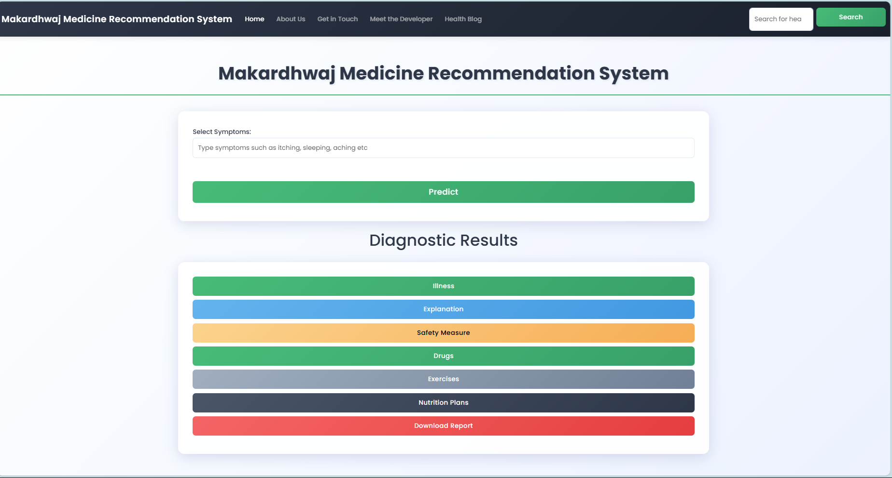
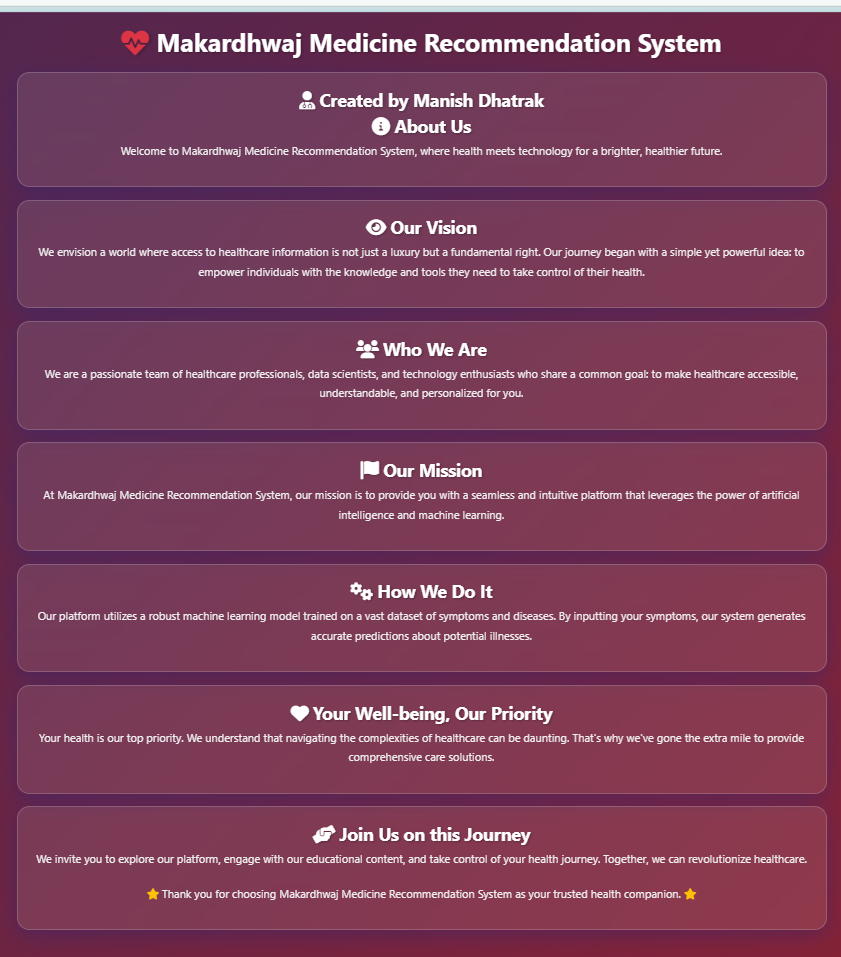
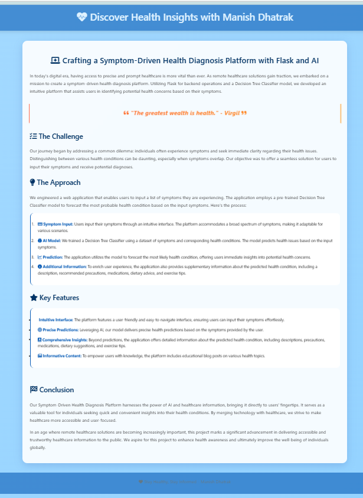
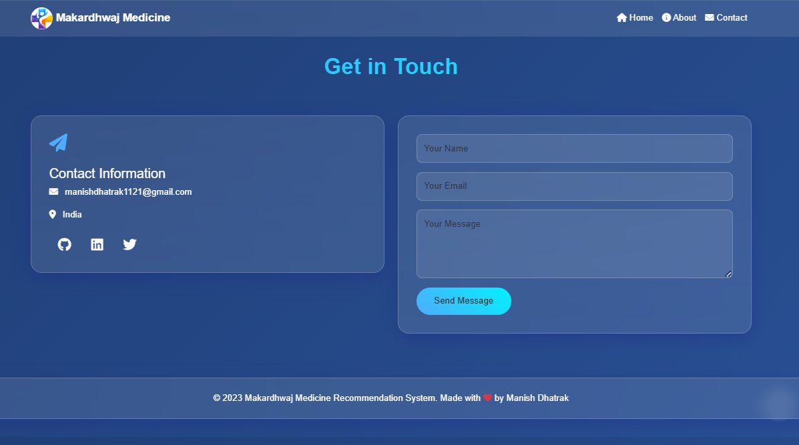
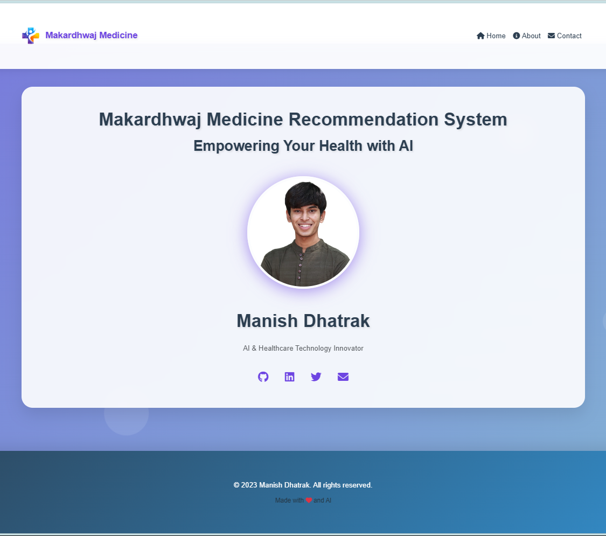
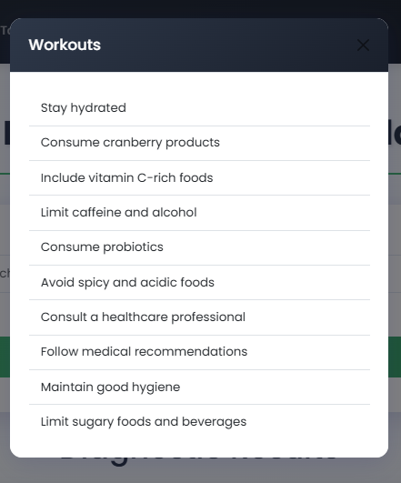

# 🌟 Makardhwaj Medicine Recommendation System

Welcome to the **Makardhwaj Medicine Recommendation System** repository! This project combines technology and healthcare to create a seamless platform that empowers users to take control of their health. 🚀💊

---

## 🏗️ Project Structure

Here's how the repository is organized:

- **`datasets/`** 📂: Contains health-related datasets for training the AI model.
- **`models/`** 🤖: Pre-trained models for disease prediction.
- **`templates/`** 🖼️: HTML templates for the web interface.
- **`static/`** 🎨: Static assets like CSS, JavaScript, and images.
- **`main.py`** 🐍: The main Flask application file.
- **`README.md`** 📘: This file!
- **`Training.xlsx`** 📊: Excel file with training data.
- **`Medicine Recommendation System.ipynb`** 📓: Jupyter notebook for model experimentation.

---

## 🌈 Features

- **User-Friendly Interface** 🎨: Intuitive and easy to navigate.
- **Accurate Predictions** ✅: Powered by a robust AI model trained on healthcare data.
- **Detailed Recommendations** 📜: Includes explanations, medications, safety measures, and more.
- **Health Blogs** ✍️: Stay informed with educational content.
- **Contact Section** 📧: Reach out directly through the platform.

---

## 🚀 Getting Started

Follow this guide to set up and run the project on your local machine:

### 1️⃣ Prerequisites

Ensure you have the following installed:

- 🐍 Python 3.8+
- 📦 Pip
- 🌐 Flask
- 📦 Required Python libraries (`pip install -r requirements.txt`)

### 2️⃣ Clone the Repository

```bash
git clone https://github.com/astromanu007/Makardhwaj-Medicine-Recommendation-System.git
cd Makardhwaj-Medicine-Recommendation-System
```

### 3️⃣ Install Dependencies

```bash
pip install -r requirements.txt
```

### 4️⃣ Run the Application

```bash
python main.py
```

The app will be available at [http://127.0.0.1:5000](http://127.0.0.1:5000). 🌐

---

## 🖼️ Screenshots

### Home Page 🌟


### About Section 📖


### Blog Page ✍️


### Contact Section 📧


### Developer Info 👨‍💻


### Recommendations Page 💡

---

## 🛠️ How It Works

1. **Input Symptoms** 📝: Users type in their symptoms through an intuitive search bar.
2. **AI Prediction** 🤖: The model predicts the most probable illness based on the symptoms.
3. **Detailed Suggestions** 📜: Users receive medications, safety measures, exercises, and dietary plans.
4. **Educational Content** 🧠: Explore blogs to stay informed about health topics.

---

## 🧑‍💻 Developer Information

Developed with ❤️ by **Manish Dhatrak**.

- **Email** 📧: [manishdhatrak1121@gmail.com](mailto:manishdhatrak1121@gmail.com)
- **GitHub**: [GitHub Repository](https://github.com/astromanu007/Makardhwaj-Medicine-Recommendation-System)
- **LinkedIn**: [LinkedIn Profile](https://www.linkedin.com/in/manish-dhatrak-b759171aa)

---

## 🌟 Contributing

We welcome contributions! To get started:

1. Fork the repository 🍴
2. Create a new branch: `git checkout -b feature-name` 🌱
3. Commit your changes: `git commit -m 'Add feature-name'` 💾
4. Push to the branch: `git push origin feature-name` 🚀
5. Open a pull request 🛠️

---

## ⚖️ License

This project is licensed under the MIT License. 📜

---

Thank you for exploring the **Makardhwaj Medicine Recommendation System**! We hope it empowers you to take charge of your health. 💪💊

Made with ❤️ by Manish Dhatrak.

